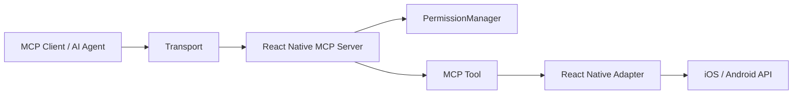

# React Native MCP

React Native MCP is a Model Context Protocol (MCP) toolkit for React Native. It exposes mobile system capabilities as MCP tools so AI agents can access clipboard, location, calendar, contacts, files, storage, networking and device connectivity through the standard MCP protocol.

The project provides the MCP runtime, permission policies, tool contracts and React Native adapters. It does not include an AI agent or a host bridge service.

## Capabilities

### Capability Packages

`@react-native-mcp/core` provides only the MCP runtime, permissions, result mapping and transports. Each capability is an independent workspace and npm package:

| Package                          | Factory                        | Main tools                                        |
| -------------------------------- | ------------------------------ | ------------------------------------------------- |
| `@react-native-mcp/system`       | `createSystemCapability`       | System/app info, network, brightness, phone calls |
| `@react-native-mcp/storage`      | `createStorageCapability`      | Read, write, remove, clear and inspect storage    |
| `@react-native-mcp/file`         | `createFileCapability`         | Upload, download, remove and inspect files        |
| `@react-native-mcp/connectivity` | `createConnectivityCapability` | Flashlight, WiFi, Bluetooth state and BLE scans   |
| `@react-native-mcp/sms`          | `createSmsCapability`          | Open the native SMS composer                      |

### Native Capability Packages

Existing native capability packages include:

- `@react-native-mcp/calendar`: List calendars and events, create events and delete events
- `@react-native-mcp/clipboard`: Read and write clipboard text using `@react-native-clipboard/clipboard`
- `@react-native-mcp/contacts`: Find and add contacts
- `@react-native-mcp/location`: Get the current location once
- `@react-native-mcp/share`: Present the native share sheet

All capability packages use the same `ReactNativeMcpCapability` contract and declare `@react-native-mcp/core` as a peer dependency.

## Installation

The project requires Node.js 20 or newer and React Native 0.83 or a compatible version.

Install the MCP runtime:

```sh
npm install @react-native-mcp/core
npm install @react-native-mcp/system @react-native-mcp/storage
npm install @react-native-mcp/file @react-native-mcp/connectivity
npm install @react-native-mcp/sms
```

Install native capability packages as needed:

```sh
npm install @react-native-mcp/calendar @react-native-mcp/clipboard @react-native-mcp/contacts
npm install @react-native-mcp/location @react-native-mcp/share
```

`@react-native-mcp/clipboard` installs `@react-native-clipboard/clipboard` automatically. After adding any package with native code, rebuild the app and run this in the iOS project:

```sh
cd ios && pod install
```

The connectivity package includes default integrations for `react-native-torch`, `react-native-wifi-reborn` and `react-native-ble-plx`. File and storage packages expose adapter contracts so the host app can choose compatible libraries without duplicating native implementations in the MCP layer.

## Basic Usage

```ts
import { createInProcessLink, createReactNativeMcpServer } from '@react-native-mcp/core';
import { createSystemCapability } from '@react-native-mcp/system';
import { createStorageCapability } from '@react-native-mcp/storage';
import { createFileCapability } from '@react-native-mcp/file';
import { createConnectivityCapability } from '@react-native-mcp/connectivity';
import { createSmsCapability } from '@react-native-mcp/sms';
import { createCalendarCapability } from '@react-native-mcp/calendar';
import { createClipboardCapability } from '@react-native-mcp/clipboard';
import { createLocationCapability } from '@react-native-mcp/location';
import { createShareCapability } from '@react-native-mcp/share';

const server = createReactNativeMcpServer({
  capabilities: [
    createSystemCapability(),
    createStorageCapability(storageAdapter),
    createFileCapability(fileAdapters),
    createConnectivityCapability(connectivityAdapters),
    createSmsCapability(),
    createCalendarCapability(),
    createClipboardCapability(),
    createLocationCapability(),
    createShareCapability(),
  ],
});

const link = createInProcessLink();
await server.connect(link.serverTransport);

const client = await createYourMcpClient(link.clientTransport);
const tools = await client.listTools();
```

`createReactNativeMcpServer` does not connect a transport automatically. React Native apps can use `InProcessTransport`; use `WebSocketBridgeTransport` when connecting to an external MCP gateway.

## Adapters

Most capability packages do not bind directly to a specific native library. They accept small adapters so the host app can choose libraries compatible with its React Native version. Connectivity has built-in defaults and accepts adapters only when an app needs to override them.

Example storage adapter:

```ts
import { createStorageCapability } from '@react-native-mcp/storage';
import { MMKV } from 'react-native-mmkv';

const storage = new MMKV();

const storageCapability = createStorageCapability({
  getString: (key) => storage.getString(key),
  setString: (key, value) => storage.set(key, value),
  remove: (key) => storage.delete(key),
  clear: () => storage.clearAll(),
  getAllKeys: () => storage.getAllKeys(),
  getSize: () => storage.getSize(),
});
```

Example connectivity adapter:

```ts
import { createConnectivityCapability } from '@react-native-mcp/connectivity';

const connectivityCapability = createConnectivityCapability({
  setFlashlight: async (enabled) => {
    await torch.switchState(enabled);
  },
  getWifiInfo: () => wifi.getCurrentConnection(),
  getBluetoothState: () => bleManager.state(),
  scanBluetooth: (options) => scanBleDevices(options),
  stopBluetoothScan: () => bleManager.stopDeviceScan(),
});
```

When a required adapter or native module is not available, the related tool returns `UNAVAILABLE` instead of fabricated device data.

## Permissions

Each tool can declare its permission requirements. An MCP call passes through the application-level `PermissionManager` before reaching a native library or the operating system permission flow.

```ts
import { aggregateAndroidPermissions, aggregateUsageDescriptions } from '@react-native-mcp/core';

const capabilities = [createLocationCapability(), createCalendarCapability()];

const iosUsageDescriptions = aggregateUsageDescriptions(capabilities);
const androidPermissions = aggregateAndroidPermissions(capabilities);
```

Add the generated iOS usage descriptions to `Info.plist`, add Android permissions to the host app configuration, and request runtime permissions as required by the third-party libraries.

The default permission policy is `ask`. The host can provide `permissionRequester` and `policyStore`:

```ts
const server = createReactNativeMcpServer({
  capabilities,
  defaultPolicy: 'ask',
  permissionRequester: async (request) => {
    return (await showPermissionDialog(request)) ? 'allow' : 'deny';
  },
});
```

Sensitive capabilities such as contacts, location and Bluetooth scanning should only be called after explicit user authorization.

## Transports



### In-process

`createInProcessLink()` connects an MCP client and server in the same JavaScript/Hermes process and is suitable for an in-app agent.

### WebSocket Bridge

`WebSocketBridgeTransport` lets the device connect outbound to an external WebSocket gateway. This allows desktop MCP clients to call mobile capabilities over the network without running a stdio server on the device.

## Errors

When a tool fails, MCP returns an `isError` result with a stable error structure:

```json
{
  "error": {
    "code": "PERMISSION_DENIED",
    "message": "Location permission was denied.",
    "recoveryHint": "Ask the user to grant permission."
  }
}
```

Available error codes:

- `PERMISSION_DENIED`
- `UNAVAILABLE`
- `UNSUPPORTED`
- `INVALID_PARAMS`
- `CANCELLED`
- `INTERNAL`

## Development

```sh
npm install
npm run typecheck
npm run lint
npm run lint:fix
npm run format
npm test -- --runInBand
npm run build
```

The repository uses npm workspaces. Every `packages/*` directory is an independently buildable package. `core` provides the shared MCP abstractions, while each capability package owns its tool schemas, permission metadata and native implementation or adapter contract.

## Design Principles

1. Keep the MCP runtime independent from specific native libraries.
2. Prefer React Native APIs and mature community libraries over reimplementing common native features.
3. Declare permissions with tools and check them before execution.
4. Convert native failures into stable error codes that agents can process.
5. Register only the capabilities enabled by the host app to reduce permissions and native dependencies.
6. Validate all inputs with Zod schemas and map all outputs through the shared MCP result layer.

## License

MIT
